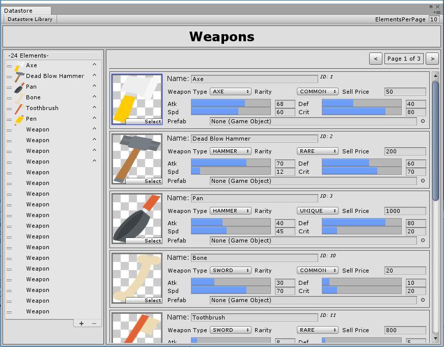
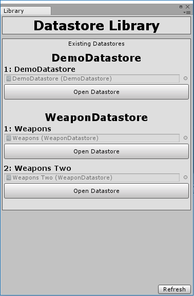

# Datastores-2018

Datastores is your one stop local database system for Unity!

No more managing the 500 ScriptableObjects holding your static game data! Throught the use of a single magical ScriptableObject, store entire encyclopedias of data in cleanly organized and customizable lists!

 And with the power of custom property drawers, you have the ability to customize the look of the editor to your heart's content. A well designed datastore can extend productivity for designers, artists, and anyone looking to modify data at any point of the development process.

<h2> <strong>Features</strong> </h2>

- Store <strong>anything</strong>! (Supports all Unity-serializable types)
- All your data is consolidated down to a <strong>single ScriptableObject.</strong>
- Full <strong>Custom Property Drawer</strong> support.
- Fully  <strong>open source.</strong>

<h2> <strong>Great use-cases include:</strong> </h2>

- Static Data
    - Weapons and stats
    - Charater info
    - Inventory items and stats
    - Collectibles
- Resource Management
    - Audio/Music/SFX
    - Scenes/Levels
    - Art/Models/Animations
- ...etc.

<h2> Datastore Library </h2>

The Datastore Library is a simple editor window that collects all existing Datastores in your Unity project and displays them alphabetically in one place for easy access.

Tested on Unity <strong>2017.1</strong> and <strong>2018.3</strong>.

Follow the Quickstart and Extras guides to get started!
